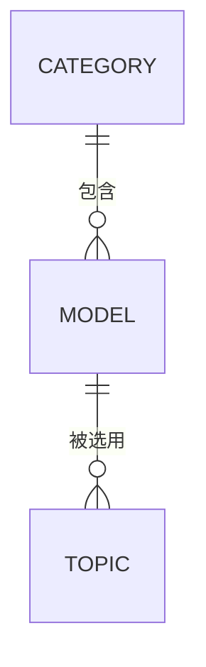

# 思维模型领域（thinkingModel）

## 领域概述

### 领域名称

- **中文名称**：思维模型
- **英文标识**：thinkingModel

### 领域职责

管理思维模型平台的思维模型库，提供平台级的思维模型定义、分类、发布和管理能力。为用户的课题分析提供可选用的标准化思维模型。

### 业务场景

1. **模型库管理**：管理平台预置的思维模型，包括商业分析、战略规划、创新思维等各类模型
2. **模型发布**：作者创建思维模型并发布到平台供其他用户选用
3. **模型分类**：按分类体系组织思维模型，便于用户浏览和查找
4. **模型选用**：用户在创建课题时从模型库中选择合适的思维模型进行分析

---

## 业务模型

> **说明**：本领域为新建领域，业务模型待补充。以下是规划中的模型结构。

### 1. 思维模型（Model）[规划中]

| 项目 | 说明 |
|------|------|
| 表名 | `thinking_models` |
| 模型目录 | `domain/thinkingModel/model/` |
| 主要功能 | 管理思维模型的基本信息、内容结构、发布状态等 |

**规划字段：**

| 字段名 | 类型 | 说明 | 约束 |
|--------|------|------|------|
| id | uint64 | 主键ID | 自增 |
| name | string | 模型名称 | 非空 |
| code | string | 模型编码 | 非空，唯一 |
| description | string | 模型描述 | 可空 |
| category_id | uint64 | 所属分类ID | 外键 |
| content | string | 模型内容JSON | 非空 |
| difficulty | int | 难度等级 | 默认1 |
| status | int | 状态：0=草稿,1=已发布 | 默认0 |

### 2. 模型分类（Category）[规划中]

| 项目 | 说明 |
|------|------|
| 表名 | `thinking_model_categories` |
| 模型目录 | `domain/thinkingModel/category/` |
| 主要功能 | 管理思维模型的分类体系，支持多级分类 |

---

## 模型关联关系



**关系说明：**

1. **Category 与 Model**：一对多关系
   - 一个分类可以包含多个思维模型
   - 模型通过 `category_id` 字段关联分类

2. **Model 与 Topic**（Subject领域）：一对多关系
   - 一个模型可以被多个课题选用
   - 课题通过 `model_id` 字段关联模型

---

## 业务能力

### 规划中的能力

#### Model 业务能力

| 能力 | 说明 |
|------|------|
| 创建模型 | 创建新的思维模型 |
| 更新模型 | 更新模型信息 |
| 发布模型 | 将模型发布到平台供用户选用 |
| 下架模型 | 下架已发布的模型 |
| 根据编码查询 | 根据唯一编码查询模型详情 |
| 列表查询 | 分页查询模型列表，支持分类筛选 |

#### Category 业务能力

| 能力 | 说明 |
|------|------|
| 树形结构查询 | 获取分类的树形结构 |
| 子分类查询 | 获取指定分类的子分类 |
| 分类移动 | 调整分类的父级关系 |

---

## 数据库表结构

### 待补充

> 表结构将在业务模型实现后补充。

---

## 目录结构

```
domain/thinkingModel/
├── README.md           # 本文件
├── model/              # 思维模型（待创建）
│   ├── model.go
│   ├── types.go
│   └── abilitys.go
└── category/           # 模型分类（待创建）
    ├── model.go
    ├── types.go
    └── abilitys.go
```

---

## 与其他领域的关系

| 领域 | 关系 | 说明 |
|------|------|------|
| subject | 被依赖 | subject.Topic 通过 model_id 引用本领域的 Model |
| practice | 被依赖 | practice.Analysis 通过 model_id 引用本领域的 Model |
| master | 依赖 | 可能依赖 master.Category 作为基础分类体系 |

---

## 变更日志

| 日期 | 版本 | 变更内容 | 作者 |
|------|------|----------|------|
| 2024-02-14 | v0.1 | 创建领域，定义初步规划 | Claude |
