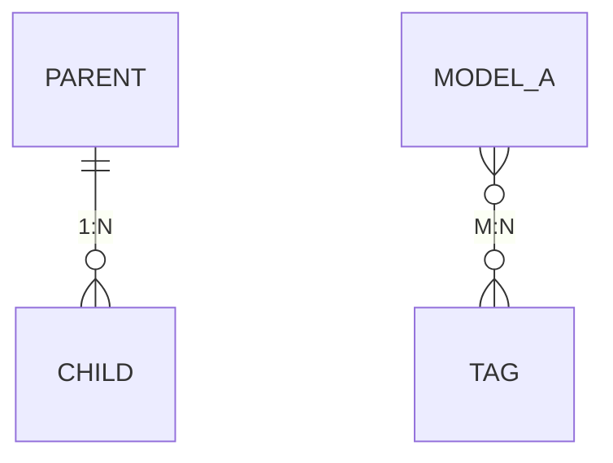

# 领域分析指南

本指南说明如何分析整个领域（domain）并编写领域级别的 README.md。

## 分析步骤

### 1. 识别领域范围

首先确定领域的边界：

```
domain/[领域名称]/
├── modelA/          # 业务模型A
├── modelB/          # 业务模型B
└── modelC/          # 业务模型C
```

列出所有子目录，每个子目录代表一个业务模型。

### 2. 提取领域基本信息

**领域名称：**
- 中文名称：从目录名或业务含义确定
- 英文标识：目录名（如 thinkingModel、practice、master）

**领域职责：**
- 该领域在整个系统中承担什么角色
- 与其他领域如何协作
- 一句话概括："管理 XXX，为 XXX 提供 XXX 能力"

**业务场景：**
- 用户使用该领域的典型场景
- 每个场景用一句话描述

### 3. 汇总业务模型

对每个业务模型提取概要信息：

```go
// 从 model.go 中提取
type ModelEntity struct {
    base.BaseModel[ModelEntity]
    Name  string  // 获取字段名和类型
    Code  string
    // ...
}

// 从 TableName() 方法获取表名
func (m *ModelEntity) TableName() string {
    return "table_name"
}
```

提取内容：
- 模型中文名（从注释或职责推断）
- 英文名（结构体名去掉 Entity）
- 表名（TableName() 返回值）
- 核心职责（从字段和自定义方法推断）

### 4. 梳理模型关联关系

**识别外键关系：**

```go
// 一对多关系（子模型中的外键）
type ChildModel struct {
    ParentId uint64  // 外键，关联父模型
}

// 多对多关系（中间表）
type ModelATag struct {
    ModelAId uint64
    TagId    uint64
}
```

**绘制 ER 图：**



### 5. 汇总领域能力

**常规能力：**
所有模型都继承自 base.BaseModel，具备相同的基础能力。

**定制化能力：**
从每个模型的 abilitys.go 中收集：

```go
// 定制化方法
func (m *ModelEntity) Publish() error
func (m *ModelEntity) GetByCode(code string) (*ModelEntity, error)
```

按模型分组整理能力清单。

### 6. 识别领域边界

**本领域依赖的其他领域：**
- 通过 import 语句识别
- 例如：`import "thinkingModels/domain/master/category"`

**依赖本领域的其他领域：**
- 搜索其他领域的 import
- 例如：`import "thinkingModels/domain/thinkingModel/model"`

## 注意事项

1. **领域文档 vs 实体文档**
   - 领域文档：关注整体，不涉及具体字段细节
   - 实体文档：关注单个模型的详细信息
   - 两者之间要有链接引用

2. **模型关系描述**
   - 使用 Mermaid 语法绘制 ER 图
   - 文字说明关系类型和关联字段

3. **能力汇总**
   - 按模型分组，不要混在一起
   - 简要说明，详细方法签名在实体文档中

4. **保持同步**
   - 新增模型时更新本文档
   - 删除模型时同步删除
   - 关系变更时更新 ER 图
