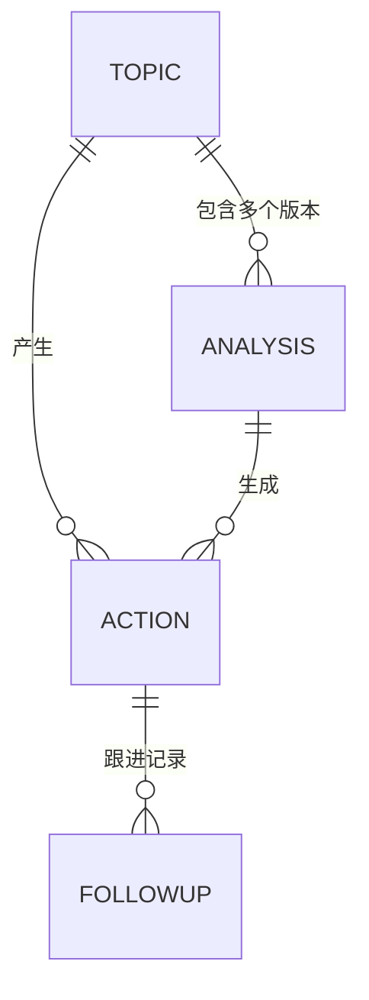
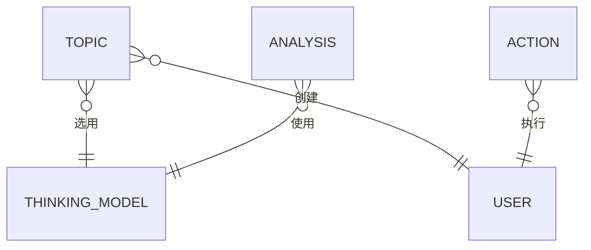

# 领域文档示例

以下是一个完整的领域级别 README.md 示例（以 practice 领域为例）：

```markdown
# 练习领域（practice）

## 领域概述

### 领域名称

- **中文名称**：练习领域
- **英文标识**：practice

### 领域职责

管理用户对思维模型的练习和应用过程，包括课题创建、分析记录、行动项管理、跟进记录等。帮助用户将思维模型应用到实际问题中。

### 业务场景

1. **课题管理**：用户创建课题，选择思维模型进行分析
2. **分析记录**：对课题使用思维模型进行分析，生成 AI 辅助分析结果
3. **行动项管理**：根据分析结果创建行动项并跟踪执行进度
4. **跟进记录**：对行动项的执行情况进行跟进和记录

---

## 领域边界

### 包含的业务模型

| 序号 | 模型名称 | 英文标识 | 表名 | 职责简述 |
|------|----------|----------|------|----------|
| 1 | 课题 | Topic | practice_topics | 管理用户的课题信息 |
| 2 | 分析记录 | Analysis | practice_analysis | 记录课题的分析过程和结果 |
| 3 | 行动项 | Action | practice_actions | 管理分析产生的行动项 |
| 4 | 跟进记录 | FollowUp | practice_followups | 记录行动项的跟进情况 |

### 与其他领域的关系

| 领域 | 关系 | 说明 |
|------|------|------|
| thinkingModel | 依赖 | 课题需要选用 thinkingModel.Model |
| subject | 被依赖 | subject.Topic 可能依赖本领域的课题 |
| iam | 依赖 | 记录创建者、执行者等用户信息 |

---

## 业务模型详情

### 1. 课题（Topic）

| 项目 | 说明 |
|------|------|
| **模型名称** | 课题 |
| **英文标识** | Topic |
| **对应表名** | practice_topics |
| **模型目录** | `domain/practice/topic/` |
| **核心职责** | 管理用户的课题信息，包括标题、描述、状态、关联的思维模型等 |

**关键字段：**

| 字段名 | 类型 | 说明 |
|--------|------|------|
| id | uint64 | 主键ID |
| title | string | 课题标题 |
| description | string | 课题描述 |
| status | int | 状态：0=进行中，1=已完成，2=已归档 |
| model_id | uint64 | 关联的思维模型ID |
| user_id | uint64 | 创建者ID |

**详细文档**：[课题模型文档](./topic/README.md)

### 2. 分析记录（Analysis）

| 项目 | 说明 |
|------|------|
| **模型名称** | 分析记录 |
| **英文标识** | Analysis |
| **对应表名** | practice_analysis |
| **模型目录** | `domain/practice/analysis/` |
| **核心职责** | 记录用户对课题使用思维模型进行分析的过程和结果 |

**关键字段：**

| 字段名 | 类型 | 说明 |
|--------|------|------|
| id | uint64 | 主键ID |
| topic_id | uint64 | 关联的课题ID |
| model_id | uint64 | 使用的思维模型ID |
| content | string | 用户填写的内容（JSON格式） |
| ai_analysis | string | AI分析结果 |
| version | int | 版本号 |
| is_current | int | 是否为当前版本：0=否，1=是 |

**详细文档**：[分析记录模型文档](./analysis/README.md)

### 3. 行动项（Action）

| 项目 | 说明 |
|------|------|
| **模型名称** | 行动项 |
| **英文标识** | Action |
| **对应表名** | practice_actions |
| **模型目录** | `domain/practice/action/` |
| **核心职责** | 管理分析产生的具体行动项，跟踪执行状态和进度 |

**关键字段：**

| 字段名 | 类型 | 说明 |
|--------|------|------|
| id | uint64 | 主键ID |
| topic_id | uint64 | 关联的课题ID |
| analysis_id | uint64 | 关联的分析记录ID |
| title | string | 行动项标题 |
| status | int | 状态：0=待执行，1=进行中，2=已完成，3=已取消 |
| progress | int | 进度百分比 |

**详细文档**：[行动项模型文档](./action/README.md)

### 4. 跟进记录（FollowUp）

| 项目 | 说明 |
|------|------|
| **模型名称** | 跟进记录 |
| **英文标识** | FollowUp |
| **对应表名** | practice_followups |
| **模型目录** | `domain/practice/followup/` |
| **核心职责** | 记录行动项的跟进情况，包括进展、问题、备注等 |

**关键字段：**

| 字段名 | 类型 | 说明 |
|--------|------|------|
| id | uint64 | 主键ID |
| action_id | uint64 | 关联的行动项ID |
| content | string | 跟进内容 |
| progress | int | 当前进度 |

**详细文档**：[跟进记录模型文档](./followup/README.md)

---

## 模型关联关系

### 领域内模型关系



**关系说明：**

1. **Topic 与 Analysis**：一对多关系
   - 一个课题可以有多条分析记录（不同版本）
   - Analysis 通过 `topic_id` 外键关联 Topic
   - 通过 `is_current` 标记当前生效的版本

2. **Topic 与 Action**：一对多关系
   - 一个课题可以有多个行动项
   - Action 通过 `topic_id` 外键关联 Topic

3. **Analysis 与 Action**：一对多关系
   - 一次分析可以产生多个行动项
   - Action 通过 `analysis_id` 外键关联 Analysis

4. **Action 与 FollowUp**：一对多关系
   - 一个行动项可以有多条跟进记录
   - FollowUp 通过 `action_id` 外键关联 Action

### 与其他领域模型的关系



**关系说明：**

1. **Topic 与 thinkingModel.Model**：多对一关系
   - 一个课题选用一个思维模型
   - Topic 通过 `model_id` 外键关联 thinkingModel.Model

2. **Analysis 与 thinkingModel.Model**：多对一关系
   - 分析记录使用一个思维模型
   - Analysis 通过 `model_id` 外键关联 thinkingModel.Model

3. **Topic/Action 与 iam.User**：多对一关系
   - 记录创建者和执行者信息
   - 通过 `user_id` 外键关联 iam.User

---

## 领域能力汇总

### 常规能力（所有模型通用）

| 能力 | 方法 | 说明 | 适用模型 |
|------|------|------|----------|
| 创建 | Create | 创建新记录 | 所有模型 |
| 更新 | Update | 更新已有记录 | 所有模型 |
| 删除 | Delete/Del | 软删除记录 | 所有模型 |
| 详情查询 | LoadById/Get | 根据ID查询详情 | 所有模型 |
| 列表查询 | List | 分页列表查询 | 所有模型 |
| 统计 | Count | 统计记录数量 | 所有模型 |

### 定制化能力（按模型分组）

#### Topic 特有能力

| 能力 | 方法 | 说明 |
|------|------|------|
| 状态更新 | UpdateStatus | 更新课题状态 |
| 选用模型 | SelectModel | 为课题选择思维模型 |
| 移除模型 | RemoveModel | 移除课题的思维模型 |
| 完成课题 | Complete | 标记课题为已完成 |
| 归档课题 | Archive | 归档课题 |
| 重新打开 | Reopen | 重新打开已完成的课题 |
| 统计查询 | GetStatistics | 获取课题统计信息 |

#### Analysis 特有能力

| 能力 | 方法 | 说明 |
|------|------|------|
| 保存AI分析 | SaveWithAi | 保存分析记录并更新AI结果 |
| 获取当前版本 | GetCurrent | 获取课题当前使用的分析记录 |
| 获取最新版本 | GetLatest | 获取课题最新版本的分析记录 |
| 获取历史版本 | GetHistory | 获取同一课题同一模型的所有版本 |
| 设置当前版本 | SetCurrent | 将指定版本设为当前版本 |
| 根据课题查询 | ListByTopic | 查询课题的所有分析记录 |

#### Action 特有能力

| 能力 | 方法 | 说明 |
|------|------|------|
| 从分析创建 | CreateFromAnalysis | 从分析记录创建行动项 |
| 更新进度 | UpdateProgress | 更新行动项执行进度 |
| 完成 | Complete | 标记行动项为已完成 |
| 取消 | Cancel | 取消行动项 |
| 统计查询 | Statistics | 获取行动项统计信息 |
| 根据课题查询 | ListByTopic | 查询课题的行动项 |
| 根据分析查询 | ListByAnalysis | 查询分析记录的行动项 |

#### FollowUp 特有能力

| 能力 | 方法 | 说明 |
|------|------|------|
| 根据行动项查询 | ListByAction | 查询行动项的所有跟进记录 |

### 领域对外接口

#### API 层接口

| 接口路径 | 方法 | 功能 | 所属模型 |
|----------|------|------|----------|
| GET /api/practice/topic/list | List | 查询课题列表 | Topic |
| GET /api/practice/topic/:id | Get | 查询课题详情 | Topic |
| POST /api/practice/topic | Create | 创建课题 | Topic |
| PUT /api/practice/topic | Update | 更新课题 | Topic |
| POST /api/practice/topic/select-model | SelectModel | 为课题选择模型 | Topic |
| POST /api/practice/topic/complete | Complete | 完成课题 | Topic |
| GET /api/practice/analysis/list | List | 查询分析记录列表 | Analysis |
| POST /api/practice/analysis/save-with-ai | SaveWithAi | 保存AI分析 | Analysis |
| POST /api/practice/analysis/set-current | SetCurrent | 设置当前版本 | Analysis |
| GET /api/practice/action/list | List | 查询行动项列表 | Action |
| POST /api/practice/action/progress | UpdateProgress | 更新进度 | Action |
| GET /api/practice/followup/by-action/:id | ListByAction | 查询跟进记录 | FollowUp |
| ... | ... | ... | ... |

#### Logic 层能力

| 能力 | 方法 | 功能 | 所属模型 |
|------|------|------|----------|
| 课题列表查询 | List | 分页查询课题列表 | Topic |
| 课题统计 | GetStatistics | 获取用户课题统计 | Topic |
| 分析历史查询 | GetHistory | 获取分析记录历史 | Analysis |
| 行动项进度更新 | UpdateProgress | 更新行动项进度 | Action |
| ... | ... | ... | ... |

---

## 数据库表清单

### 表列表

| 表名 | 中文名 | 所属模型 | 说明 |
|------|--------|----------|------|
| practice_topics | 课题表 | Topic | 存储课题基本信息 |
| practice_analysis | 分析记录表 | Analysis | 存储分析过程和结果 |
| practice_actions | 行动项表 | Action | 存储行动项信息 |
| practice_followups | 跟进记录表 | FollowUp | 存储跟进记录 |

### 表关系

```
practice_topics (1) ──────< (N) practice_analysis
     │                           │
     │                           │
     └────────────< (N) practice_actions <──────< (N) practice_followups
```

---

## 目录结构

```
domain/practice/
├── README.md              # 本文件（领域文档）
├── topic/                 # 课题模型
│   ├── README.md         # 模型详细文档
│   ├── model.go
│   ├── types.go
│   └── abilitys.go
├── analysis/              # 分析记录模型
│   ├── README.md
│   ├── model.go
│   ├── types.go
│   └── abilitys.go
├── action/                # 行动项模型
│   ├── README.md
│   ├── model.go
│   ├── types.go
│   └── abilitys.go
└── followup/              # 跟进记录模型
    ├── README.md
    ├── model.go
    ├── types.go
    └── abilitys.go
```

---

## 变更日志

| 日期 | 版本 | 变更内容 | 作者 |
|------|------|----------|------|
| 2024-02-14 | v1.0 | 初始版本，定义练习领域 | Claude |
```
