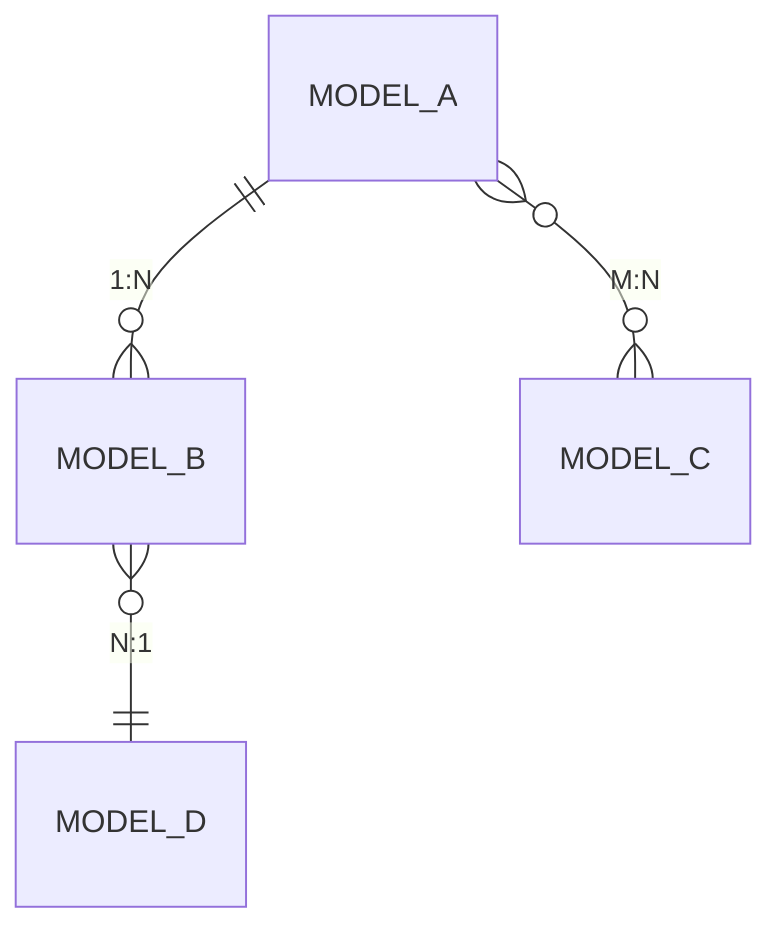
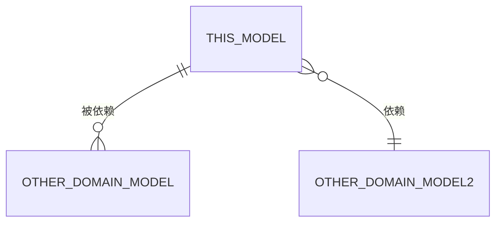

# 领域文档模板

以下是领域级别 README.md 的标准模板，关注整体而非单个模型细节。

```markdown
# [领域中文名称]（[领域英文标识]）

## 领域概述

### 领域名称

- **中文名称**：[中文名]
- **英文标识**：[英文名，如 thinkingModel/practice]

### 领域职责

[描述该领域负责的核心业务范围，1-2 句话概括]

### 业务场景

[列举该领域的典型使用场景，2-4 个场景]

---

## 领域边界

### 包含的业务模型

| 序号 | 模型名称 | 英文标识 | 表名 | 职责简述 |
|------|----------|----------|------|----------|
| 1 | [模型A] | ModelA | table_a | [一句话描述] |
| 2 | [模型B] | ModelB | table_b | [一句话描述] |
| ... | ... | ... | ... | ... |

### 与其他领域的关系

| 领域 | 关系 | 说明 |
|------|------|------|
| [领域X] | 依赖 | 本领域依赖领域X的[模型] |
| [领域Y] | 被依赖 | 领域Y依赖本领域的[模型] |

---

## 业务模型详情

### 1. [模型A名称]（[模型英文标识]）

| 项目 | 说明 |
|------|------|
| **模型名称** | [中文名] |
| **英文标识** | [英文名] |
| **对应表名** | [表名] |
| **模型目录** | `domain/[领域]/[模型]/` |
| **核心职责** | [职责描述] |

**关键字段：**

| 字段名 | 类型 | 说明 |
|--------|------|------|
| id | uint64 | 主键ID |
| name | string | 名称 |
| ... | ... | ... |

**详细文档**：[模型文档链接](./[模型]/README.md)

### 2. [模型B名称]（[模型英文标识]）

...

---

## 模型关联关系

### 领域内模型关系



**关系说明：**

1. **[模型A] 与 [模型B]**：一对多关系
   - 一个 [模型A] 可以包含多个 [模型B]
   - [模型B] 通过 `model_a_id` 外键关联 [模型A]

2. **[模型A] 与 [模型C]**：多对多关系
   - 通过中间表 `model_a_c_relation` 关联

### 与其他领域模型的关系



**关系说明：**

1. **本领域 [模型X] 与 [领域Y].[模型Z]**：一对多关系
   - [领域Y] 的 [模型Z] 通过 `model_x_id` 外键引用本领域 [模型X]

---

## 领域能力汇总

### 常规能力（所有模型通用）

| 能力 | 方法 | 说明 | 适用模型 |
|------|------|------|----------|
| 创建 | Create | 创建新记录 | 所有模型 |
| 更新 | Update | 更新已有记录 | 所有模型 |
| 删除 | Delete/Del | 软删除记录 | 所有模型 |
| 详情查询 | LoadById/Get | 根据ID查询详情 | 所有模型 |
| 列表查询 | List | 分页列表查询 | 所有模型 |
| 统计 | Count | 统计记录数量 | 所有模型 |

### 定制化能力（按模型分组）

#### [模型A] 特有能力

| 能力 | 方法 | 说明 |
|------|------|------|
| [能力1] | [MethodName] | [说明] |
| [能力2] | [MethodName] | [说明] |

#### [模型B] 特有能力

...

### 领域对外接口

#### API 层接口

| 接口路径 | 方法 | 功能 | 所属模型 |
|----------|------|------|----------|
| POST /api/[领域]/[模型] | Create | 创建... | [模型A] |
| GET /api/[领域]/[模型]/:id | Get | 查询... | [模型A] |
| ... | ... | ... | ... |

#### Logic 层能力

| 能力 | 方法 | 功能 | 所属模型 |
|------|------|------|----------|
| [能力1] | [Method] | [功能] | [模型A] |
| [能力2] | [Method] | [功能] | [模型B] |

---

## 数据库表清单

### 表列表

| 表名 | 中文名 | 所属模型 | 说明 |
|------|--------|----------|------|
| table_a | [表A中文名] | ModelA | [说明] |
| table_b | [表B中文名] | ModelB | [说明] |
| table_relation | [关联表] | ModelA+ModelB | 多对多关系表 |

### 表关系

```
table_a (1) ──────< (N) table_b
  │
  │
  └──────< (N) table_c
```

---

## 目录结构

```
domain/[领域]/
├── README.md              # 本文件（领域文档）
├── [模型A]/               # 业务模型A
│   ├── README.md         # 模型文档（由 entity-knowledge-doc 生成）
│   ├── model.go
│   ├── types.go
│   └── abilitys.go
├── [模型B]/               # 业务模型B
│   ├── README.md
│   ├── model.go
│   ├── types.go
│   └── abilitys.go
└── ...
```

---

## 变更日志

| 日期 | 版本 | 变更内容 | 作者 |
|------|------|----------|------|
| YYYY-MM-DD | v1.0 | 初始版本 | [作者] |
```
